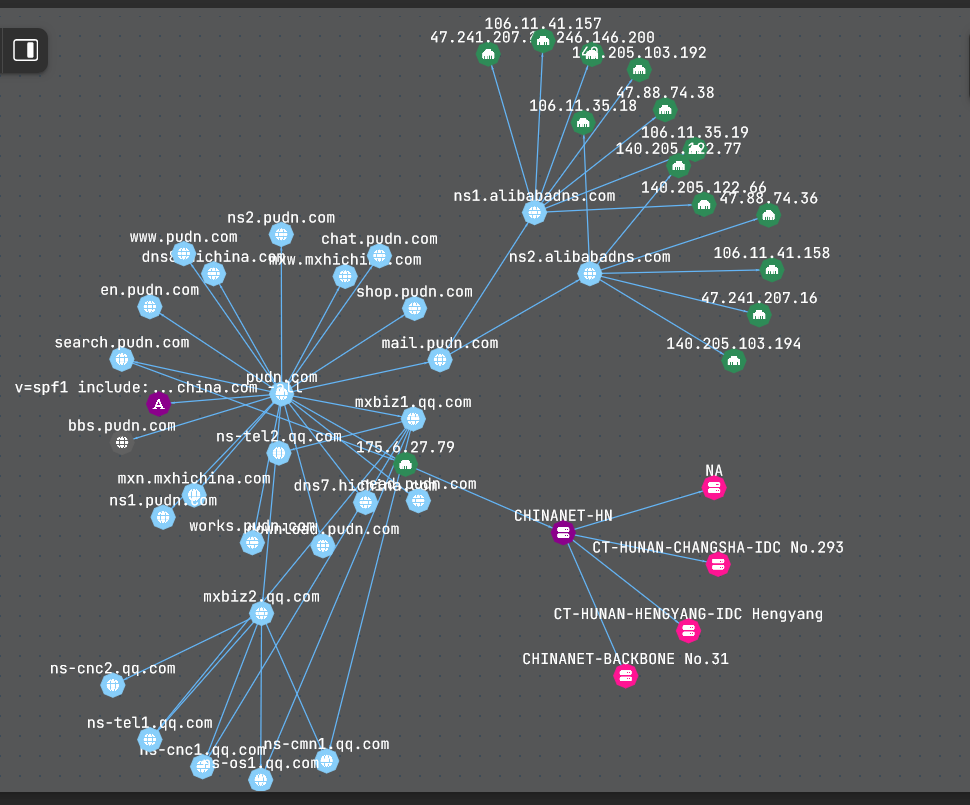

# sh-1993
```<sh-1993>``` is the username of an entity responsible for hacking github.com on an industrial scale. Work submitted to github repo's is duplicated on a Chinese website called pudn.com

* pudn.com contains 8,460000 files extracted programmatically from github.com over the course of time.
* pudn.com has 5,900000 registered Chinese users
  
* The data from github repo's is scraped every 10 minutes 24hrs a day and uploaded to servers in Changsha , Hunan province , China.
* pudn.com un inaccessable to western users via browser due to the fact that the website has no SSL certificate and is therefore blocked by google,mozilla e.t.c
* ```IP address : 175.0.0.0```
* Organization: CHINANET HUNAN PROVINCE NETWORK China Telecom No.31,jingrong street Beijing 100032
* Location: China, Changsha(28.2014, 112.9611, ~10km)

**********************************************************************************************

***********************************************************************************************
folders include :
* ```last 24hrs``` ; a folder containing uploads made to github and then reproduced on pudn.com within the last 24hrs, it is by no means comprehensive.
* ```keyword``` ; a folder containing all the files taken from pudn.com with the keyword 'genesis' , illustrating the
  scale of the operation.
* ```iframe.html``` enables safe browsing of pudn.com.  
* js and css contain the jsa and css used by the site .
* ```pudn-viewer``` enables you to view recent index pages from pudn com as they appear on the website. Github is scraped approx every 10 mins and the
* most recent uploads appear on the index page of pudn.com as seen in the 'viewer'.
* ```cronos.py``` is a python script that scrapes the site for all the new uploads it has most recently reposted from github.
* 'comparison files' illustrates the similarity of the content of uploaded github files with those reposred on pudn.com.  
* ```data.json``` contains relevant data pertaining to the website pudn.com
* ```pudn.com-keyword-genesis.txt``` contains the 30 pages of data harvested from the keywoed search prior to cleaning and data extraction.
* an html file is created programmatically with the format , ```1516516556534242.html``` , each file representing a github listing.
* the example index pages of our work in this repo have been renamed by me in order so as to be more human readable , with both the
* listed name submitted by the git hub user and the chinese name injected by pudn.com prior to relisting in China.
* the file of my own work i discovered was named 'genesis' therefore the files in the 'keyword' folder are all of the files on
* pudn.com with the keyword 'genesis'.
***************************************************************************************************
TXT on login page of pudn.com : 
* Welcome to the United Development Network
* One-stop service platform for programmers
* New users will receive 200 points when registering.
* Uploaded data can be downloaded 20 times a day, non-uploaded data can only be downloaded 5 times a day.
* Users without points can download 2 times a day. You need to verify your mobile phone number to download

***************************************************************************************************
* security @ git hub have been informed but have failed to respond to the information provided within 24hrs , 
* i have therefore decided to take the matter into my own hands.
* The work in both mine and your github repo's is our intellectual property , and is protected by law.
